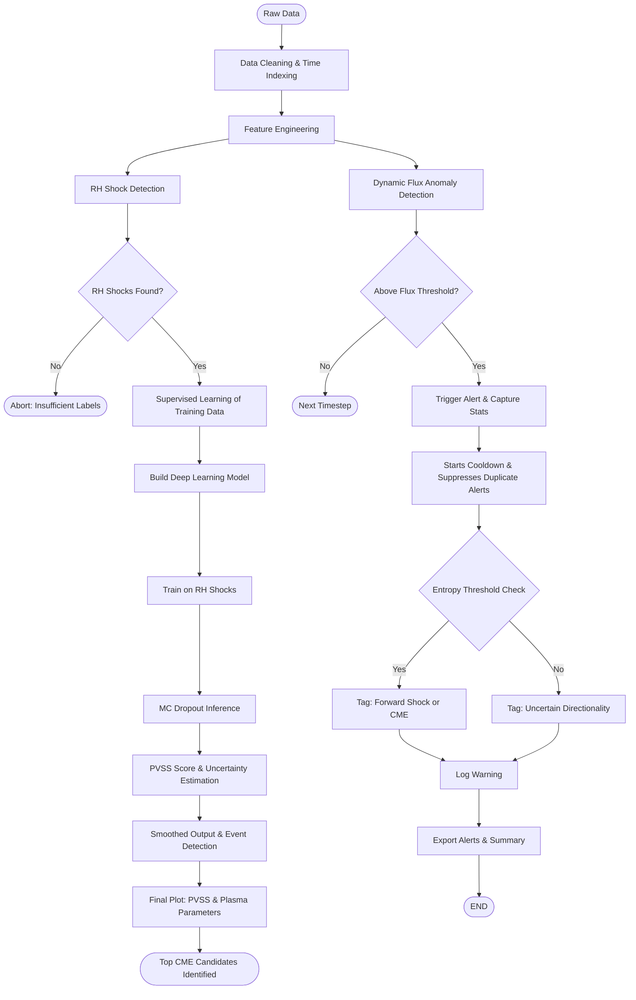

# Halo CME Detection and Warning System

**Real-Time CME Shock Warning System Using Aditya-L1 Data**

Bharatiya Antariksh Hackathon 2025 — Team Interstellar, IIT Guwahati

---

## Overview

This system detects Coronal Mass Ejection (CME)-driven shocks before they strike, using only onboard particle and magnetic field data from Aditya-L1's ASPEX payload. It is fast, physics-grounded, and operates in real time without requiring coronagraphs or lagging Earth-based indicators.

The system is composed of two independent yet complementary features:

**Feature 1 — Statistical Anomaly Detector (STEPS-based):** A physics-informed early warning mechanism that monitors energetic particle data from the STEPS instrument.

**Feature 2 — Deep Learning-Based Detector (SWIS + MAG):** A CNN-LSTM-Attention model trained on solar wind and magnetic field data, producing a physics-validated shock score (PVSS) with uncertainty quantification.

---

## Architecture



---

## Features

### Feature 1: Predictive Particle Spike Warning

**Data used:** SWIS + STEPS

| Feature | Description |
|---|---|
| Dynamic Flux Detection | Adapts to background using a 12-hour rolling IQR baseline with no static thresholds. Computes confidence based on anomaly strength. |
| High-Energy Weighting | Prioritizes extreme events over low-energy background noise. |
| Cross-Entropy Directionality | Uses Cross-Entropy Divergence between inner and outer bins, inspired by Kullback-Leibler (KL) Divergence, to detect beam-like flux patterns characteristic of halo CMEs. |
| Adaptive Thresholding | Dynamically adjusts alert sensitivity based on real-time background noise levels. |
| Physics-Based Cooldown | Prevents alert spam by scaling the reset time proportionally with event length. |

### Feature 2: Real-Time Shock Detection

**Data used:** SWIS + MAG

**Physics Consistency Checks:**
- Plasma Beta (β) Analysis
- MHD Flow Regime Classification (Mach Numbers)
- Rankine-Hugoniot Filtering to validate true shocks
- Mahalanobis Distance Anomaly Detection
- Particle Flux Entropy Analysis
- Entropy Gradient Shock Trigger

**ML Architecture:**
- Hybrid CNN-LSTM-Attention architecture
- Comprehensive diagnostic plots
- Multi-dimensional anomaly detection
- Monte Carlo Uncertainty Estimation

## Prototype Validation

Both features were validated on real Aditya-L1 data from ISSDC over a 72-hour window (October 8-10, 2024), a period containing known geomagnetic disturbances.

### Feature 1 Results

Over the 3-day test window, the statistical model detected 21 distinct warning events. A sample of key alerts:

| Time (UTC) | Flux Anomaly | Confidence Score | Asymmetry Distr. | Conclusion |
|---|---|---|---|---|
| 2024-10-09 05:38 | 19.7x | 1.00 | No | Very strong early shock signal |
| 2024-10-10 11:51 | 1.2x | 0.52 | Yes | Likely CME front hitting L1 |
| 2024-10-10 14:02 | 2.3x | 0.63 | Yes | Confirmed shock arrival (chaotic plasma) |
| 2024-10-10 14:52 | 13.5x | 1.00 | Yes | Major flux spike and confirmed CME hit |

> Known CME data taken from Richardson & Cane catalog.

### Feature 2 Results

The CNN-LSTM-Attention model was trained on one month of solar wind data from August 2024. When deployed on the October test window, it produced a sharp, high-confidence peak in the PVSS output aligned with the known CME arrival. Optimal performance was achieved at 4 training epochs.

---

## Technologies

**Stack:** Python 3.8+, Google Colab, Pandas, NumPy, Matplotlib, TensorFlow, Keras

**Model Architecture:** The final deep learning model is a CNN-LSTM-Attention hybrid. The CNN layer identifies key local patterns such as shock spikes. The LSTM layer captures the temporal evolution of these patterns. The Attention layer focuses the model on the most critical moments within each sequence.

## Directory Structure

```
.
├── notebooks/
│   ├── Feature1_Warning_System.ipynb
│   └── Feature2_Real_Time_Shock_Detection.ipynb
│
├── src1/                        # Feature 1 (STEPS) source code
│   ├── config.py
│   ├── warning_system.py
│   └── cross_entropy.py
│
├── src2/                        # Feature 2 (ML) source code
│   ├── config.py
│   ├── data_preparation.py
│   ├── feature_engineering.py
│   └── shock_labeler.py
│
├── docs/                        # Submission materials
│   ├── Team_Interstellar_one-pager.pdf
│   └── Bharatiya_Antariksh_Hackathon_2025_Idea_Submission.pdf
│
└── README.md
```

---

## How to Run

**Requirements:** Python 3.8+. Recommended environment: Google Colab or local Jupyter Notebook.

Data download: [Google Drive](https://drive.google.com/drive/folders/1KP682x8tB9-upPKgjz5IJH3mVh-ns4ey)

### Feature 1 — Statistical Detector

1. Open `Feature1_Warning_System.ipynb` from the `notebooks/` directory.
2. Upload your aligned STEPS + SWIS CSV file.
3. Run all cells to simulate particle anomaly detection.
4. Output: `issued_alerts.csv` with warnings, confidence metrics, and entropy validation.

### Feature 2 — Deep Learning Detector

1. Open `Feature2_Real_Time_Shock_Detection.ipynb`.
2. Upload the training file (`aditya_l1_master_training_data_5sec.parquet`) and test file (`swis_mag_master_combined.csv`).
3. Run all cells to engineer physics-informed features, automatically label shocks via RH conditions, train the CNN-LSTM-Attention model, and generate PVSS predictions with uncertainty bands.
4. Output: Top PVSS candidates, entropy analytics, and final diagnostic plots.

---

## Output Highlights

- `issued_alerts.csv` — Alerts with timestamps, anomaly scores, high-energy flux, and entropy validation
- PVSS score plot — Temporal evolution of shock probability with uncertainty bands
- Physics overlays — Plasma speed, magnetic field strength, and entropy gradients

---

## Team

**Team Interstellar** — Indian Institute of Technology Guwahati

Bharatiya Antariksh Hackathon 2025 | Problem Statement: Identifying halo CME events based on particle data from SWIS-ASPEX payload onboard Aditya-L1

- [Amey Taksali](https://github.com/CIPHERclux) — Team Leader
- [Ridhima Gupta](https://github.com/guptaridhima06)
- [Nihira Patwardhan](https://github.com/Nihira8006)

---

## License

Released under the MIT License. You are free to use, modify, and distribute this code with attribution.
